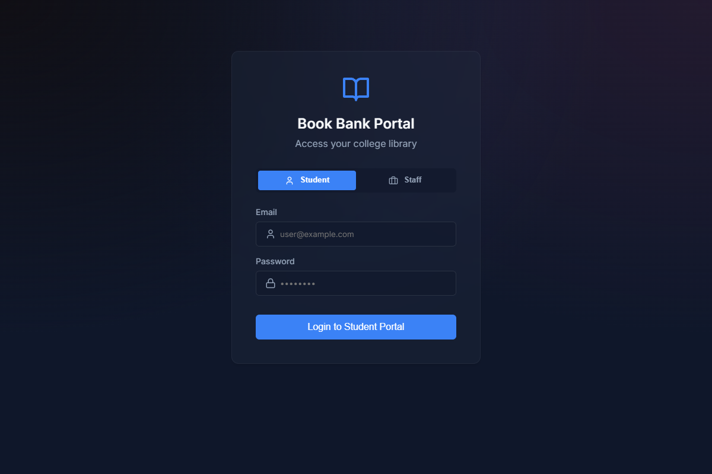
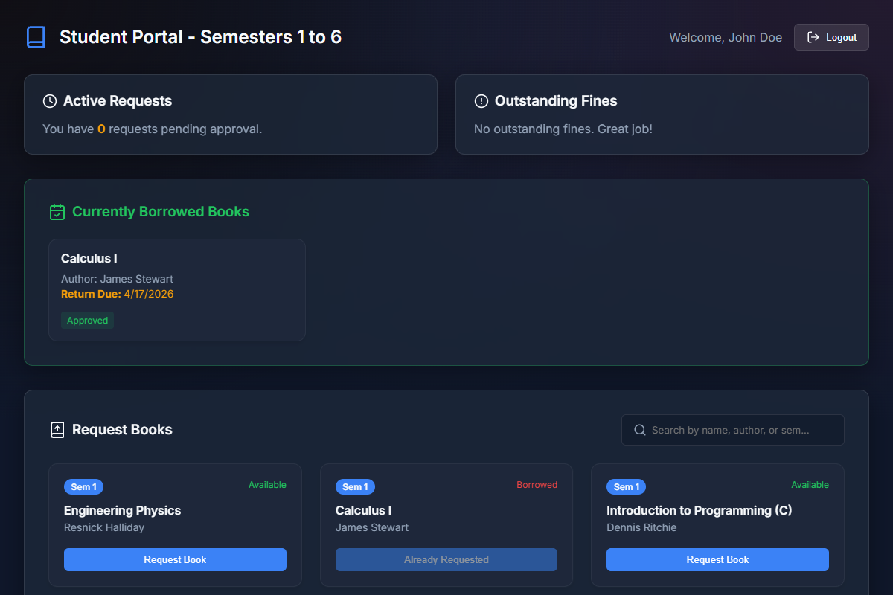
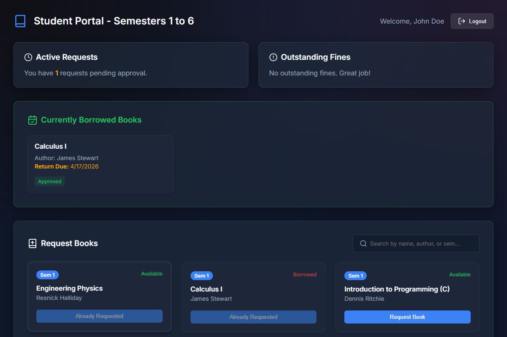
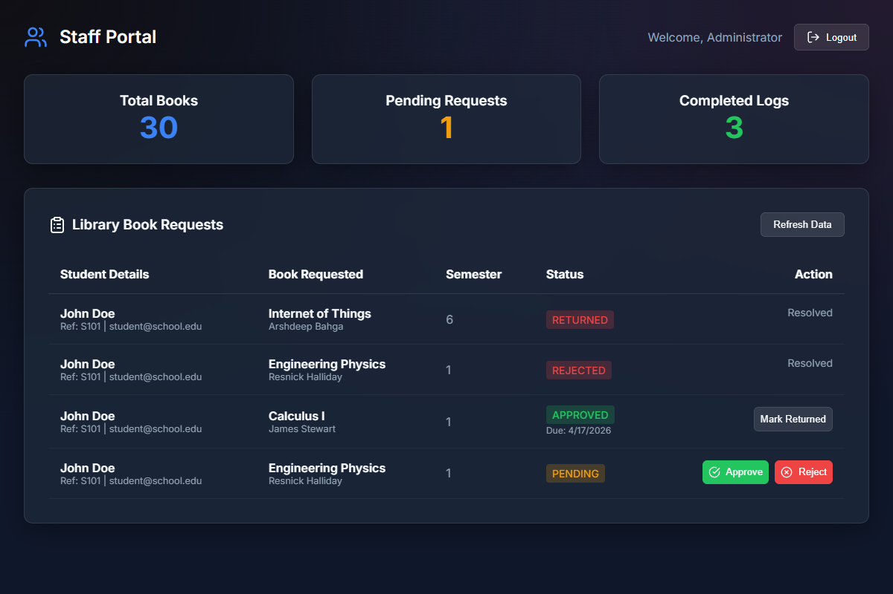
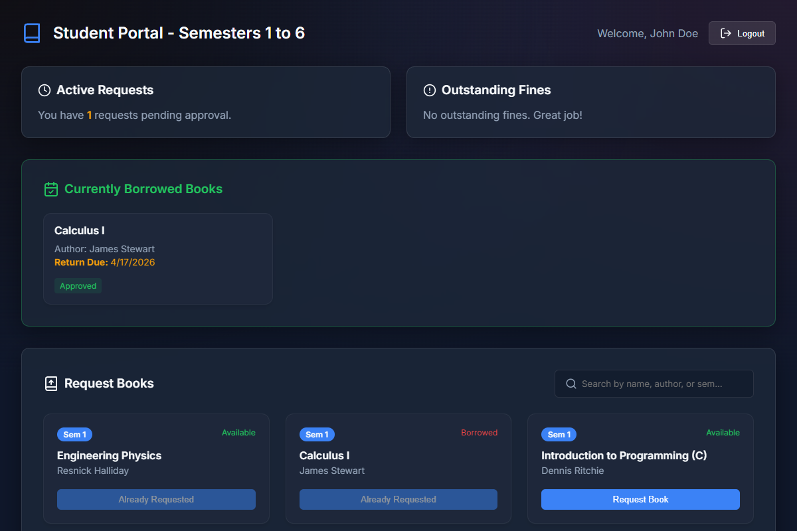

# Book Bank Management System

## Project Description
A web-based Book Bank Management System that enables students to browse and request library books by semester, track borrow status and return dates. It also streamlines the workflow for library staff through secure data handling and efficient request processing.

## Technologies Used
- **Frontend**: React.js (Vite), CSS3
- **Backend**: Node.js, Express.js
- **Database**: SQLite with Prisma ORM
- **Authentication**: JWT (JSON Web Token)

## Output Screenshots

### 1. Login Authentication Page

### 2. Student Dashboard - Browsing & Requests

### 3. Student Dashboard - Book Requested

### 4. Staff/Admin Portal - Approving Books & Logs

### 5. Student Dashboard - Return Date Visible Automatically After Approval

